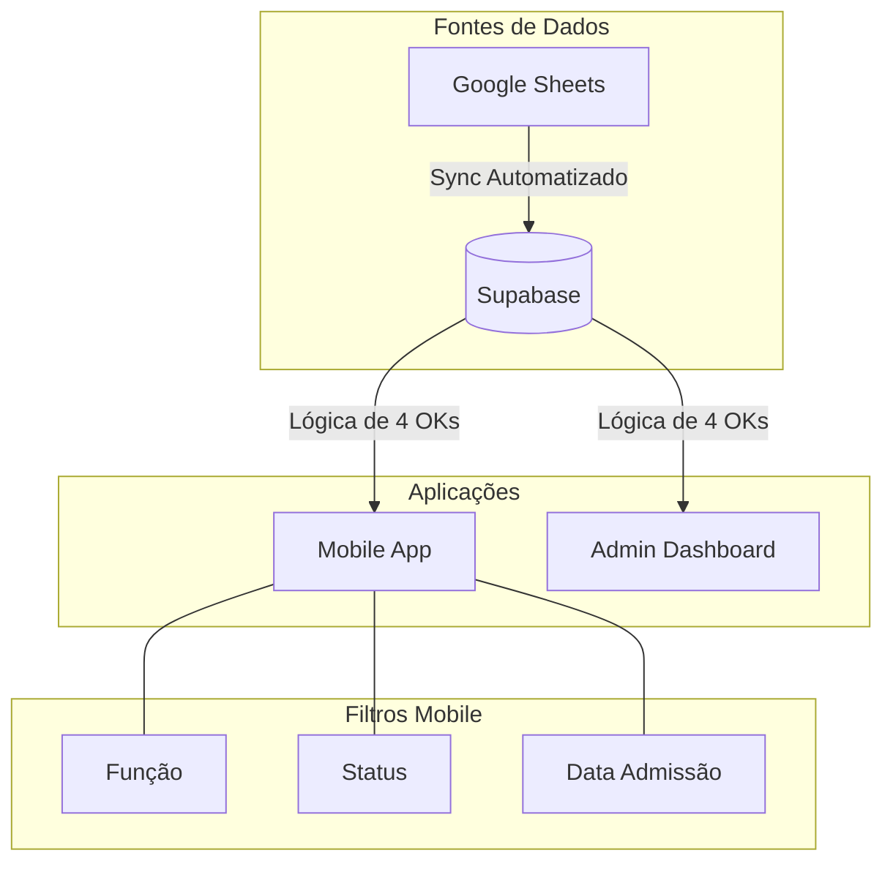

# Release Notes - v1.18

## 🚀 Novidades

### 📱 Mobile App
- **Filtros de Data de Admissão:** Adicionados campos de "Início Admissão" e "Fim Admissão" com interface premium e funcionalidade em tempo real.
- **Paridade com Web:** Lógica de status unificada (necessário 4 "OK" para liberação).
- **Novo Ícone:** Substituição do ícone padrão por uma identidade visual exclusiva EcoordinaSmart.
- **Parsing de Datas:** Implementada lógica robusta para entender múltiplos formatos de data (ISO e PT-BR).

### 🛠️ Correções e Melhorias
- Correção de bug de tela em branco no Mobile causado por mapeamento de campos.
- Atualização do período padrão de visualização até 31/03/2026.

## 📊 Arquitetura Atualizada

## 📸 Demonstração do Novo Ícone

