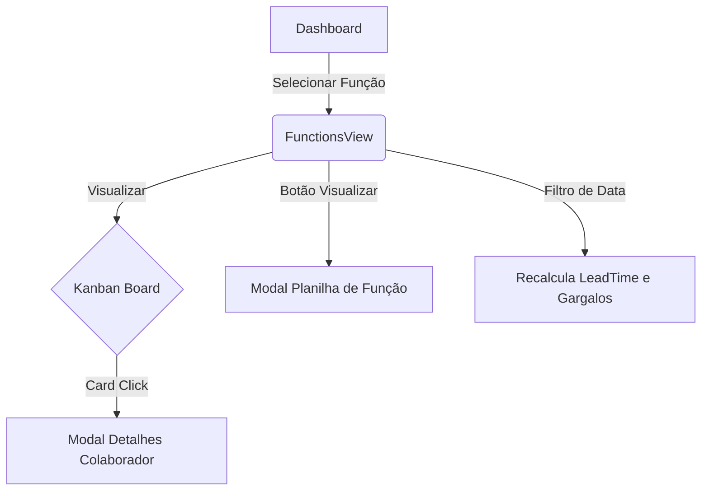

# Release Notes - v1.15

## 🏆 Novidades da Versão
Esta versão foca na otimização da visualização por funções, introduzindo um quadro Kanban interativo, análise de gargalos e uma visão em planilha detalhada para cada função.

### 🚀 Principais Mudanças
1.  **Quadro Kanban por Função:** Nova visualização `FunctionsView` que organiza os colaboradores de uma função específica em colunas (Pendente vs Liberado).
2.  **Análise de Gargalos (Bottleneck):** Implementação de lógica de LeadTime por departamento (RH, Saúde, Seguridade) para identificar onde as liberações estão retidas.
3.  **Modal de Planilha (Spreadsheet View):** Visualização tabular premium com cabeçalho de seção e de colunas em tema escuro (`slate-900`). Agora inclui botões dedicados para exportação em **EXCEL** e **PDF**.
4.  **Refactor de Layout (App.tsx):**
    *   Cabeçalho agora é fixo (sticky) para manter contexto.
    *   Informações de status e data de atualização movidas para a esquerda para melhor fluxo de leitura.
    *   Remoção de elementos desnecessários (sino de notificação) para um design mais focado.
5.  **Cálculo de Dias Úteis:** LeadTime agora ignora fins de semana para métricas de eficiência mais precisas.

## 📊 Fluxo de Navegação

## 🛠️ Detalhes Técnicos
- **Novos Componentes:** `FunctionsView.tsx`, `RoleSpreadsheetModal.tsx`.
- **Lógica Central:** Lógica de agregação no frontend otimizada para datasets complexos.
- **Design:** Uso intenso de `framer-motion` para transições suaves e `Tailwind CSS` para layout responsivo.

---
*Release gerada automaticamente pelo sistema de CI/CD Google Antigravity.*
