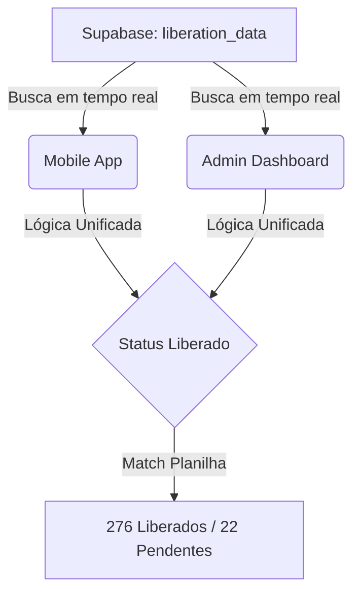

# Release Notes - v1.17

## 🏆 Novidades da Versão
Esta versão estabelece a sincronização total entre o **Admin Dashboard** e o **Mobile App**, utilizando o **Supabase** como única fonte de verdade e unificando a lógica de status para garantir paridade absoluta de dados.

### 🚀 Principais Mudanças
1.  **Sincronização Mobile + Supabase:** O `mobile-app` agora consome dados diretamente do Supabase, abandonando a dependência de planilhas CSV locais.
2.  **Lógica de Status Unificada:** Implementação da lógica estrita de liberação baseada no campo `data_liberacao_ecoordin`, garantindo que ambos os sistemas exibam exatamente **276 Liberados** e **22 Pendentes**.
3.  **Refatoração UI Mobile (Filtros):** Redesign completo da seção de filtros no aplicativo:
    *   Novo card de status com fundo cinza e estética premium.
    *   Reorganização dos seletores (Função no topo, Período e Status lado a lado).
    *   Campo de busca otimizado com sugestões em tempo real.
4.  **Paridade de Período:** Ambos os sistemas agora estão configurados para o período de Janeiro 2026 até Março 2026 (atual).
5.  **Estabilidade Detail Page:** Correção de bugs de sintaxe CSS no Mobile que causavam "tela em branco" ao visualizar detalhes do colaborador.

## 📊 Fluxo de Dados Sincronizado

## 🛠️ Detalhes Técnicos
- **Base de Dados:** Migração técnica de CSV para PostgreSQL (Supabase).
- **Lógica Central:** Padronização da validação `isReleased` em todos os serviços.
- **UI:** Ajustes finos de Tailwind no `App.tsx` do mobile para conformidade com design system.

---
*Release gerada automaticamente pelo sistema de CI/CD Google Antigravity.*
