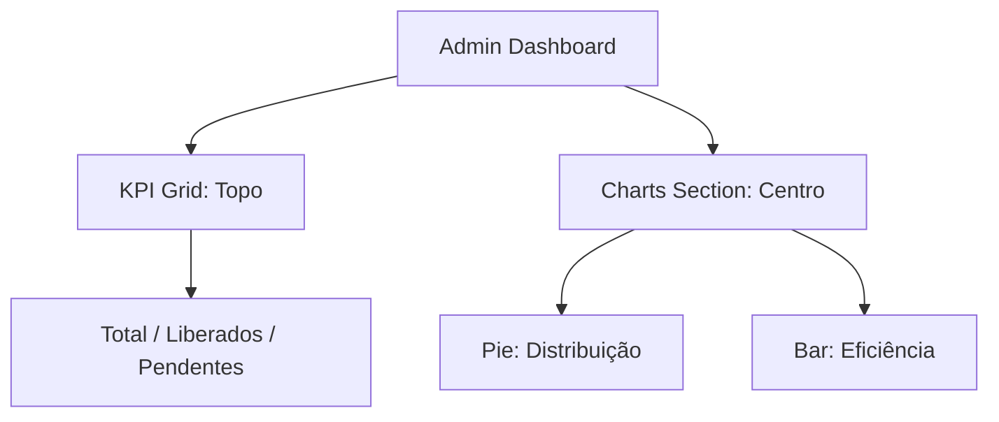
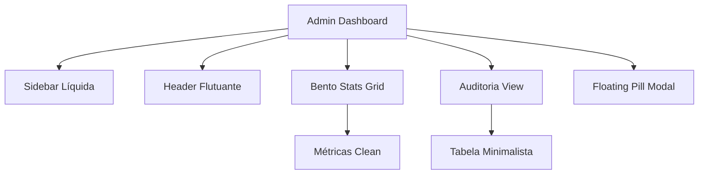

# Release Notes - v1.7 (Overview Redesign Refinement)

## 📋 Resumo
Transformação da tela de "Visão Geral" em uma apresentação executiva minimalista e de alto impacto, com foco absoluto em KPIs e gráficos.

## 🚀 Novidades
- **KPIs Prioritários:** Métricas de Total, Liberados e Pendentes movidas para o topo com números em tamanho 5xl para máxima visibilidade.
- **Gráficos com Labels:** Adição de rótulos de dados diretos (labels) nos gráficos de Pizza e Barras.
- **Minimalismo Extremo:** Remoção do botão de exportação e de todas as seções informativas abaixo dos gráficos para uma visão limpa e focada.

## 📊 Arquitetura

---
**Versão Física:** `/versao/v1.7-redesign-visao-geral`
**Tag Git:** `v1.7`

# Release Notes - v1.6 (Pagcorp Edition)

## 🚀 O que há de novo?
Redesign radical do Admin Dashboard para uma estética minimalista de alto nível.

### 🎨 Design & UI
- **Ultra Clean Layout**: Paleta baseada em Branco Puro (#FFFFFF) e Slate-900.
- **Squircle System**: Border-radius unificado em 32px/48px para suavidade absoluta.
- **Floating Architecture**: Header e Sidebar com sombras extremamente sutis.
- **Métricas Italic**: Nova tipografia Black Italic para números de estatísticas.
- **Status Sync**: Indicadores visuais circulares e minimalistas para auditoria.

### 🛠️ Melhorias Técnicas
- **Code Cleanup**: Remoção de variáveis e funções não utilizadas.
- **JSX Optimization**: Correção de erros de sintaxe e renderização condicional.
- **Data Logic**: Padronização de nomes de campos (ex: `seguranca` garantido).

## 📊 Arquitetura Visual

---
**Versão Física:** `/versao/v1.6-redesign-ultra-clean`
**Tag Git:** `v1.6`
