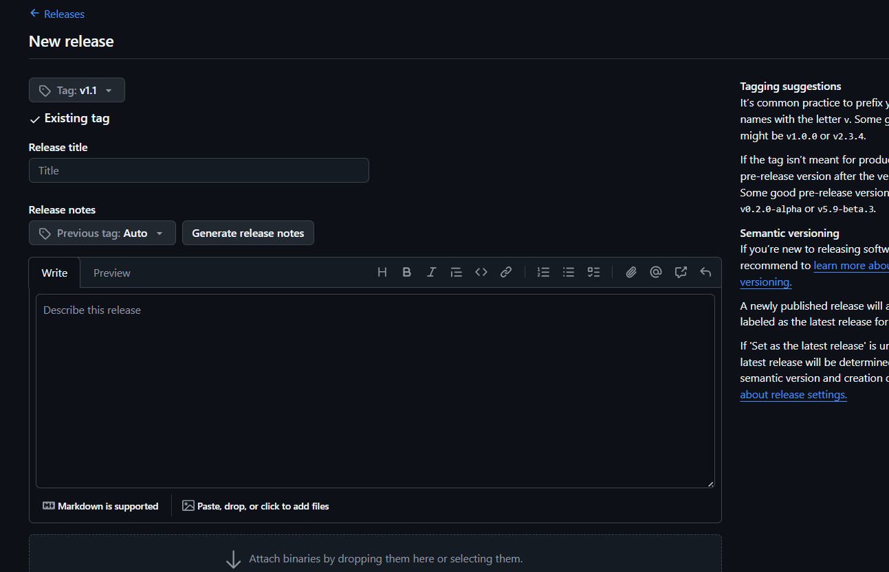

# Versão v1.1 - Variáveis Globais

**Data:** 31/01/2026  
**Legenda:** Variáveis Globais

## 📋 O que foi implementado

Esta versão introduz um **Design System Global completo** que permite customização ultra-rápida de todo o projeto através de um único arquivo de configuração.

### ✨ Novos Recursos

#### 1. **Sistema de Cores Dinâmicas**
- Cor primária configurável (`PRIMARY_COLOR`)
- Sombras automáticas que seguem a cor da marca
- Sincronização automática entre TypeScript e CSS

#### 2. **Tipografia Global**
- `HERO`: Tamanho dos títulos principais (36px)
- `TITLE`: Tamanho dos títulos de seção (24px)
- `BODY`: Tamanho do texto padrão (16px)
- `SMALL`: Tamanho de textos auxiliares (12px)

#### 3. **Sistema de Espaçamento**
- `SECTION_GAP`: Distância entre blocos grandes (32px)
- `ELEMENT_GAP`: Distância entre botões/inputs (16px)
- `LOGO_TOP`: Margem superior do logo inicial (48px)
- `CONTAINER_PADDING`: Respiro lateral das telas (24px)

#### 4. **Organização de Arquitetura**
- Todos os arquivos de configuração movidos para `src/arquitetura/`
- Documentação completa em `arquitetura/customizacao/`

## 🎯 Como usar

Edite o arquivo **[`src/arquitetura/brand.config.ts`](file:///c:/Users/Adm/Downloads/eoorddinasmart/mobile-app/src/arquitetura/brand.config.ts)** para mudar:
- Cores
- Tamanhos de fonte
- Espaçamentos
- Logos
- Nome da aplicação

O sistema atualizará automaticamente toda a interface.

## 📁 Arquivos desta versão

- `App.tsx.bak` - Componente principal com injeção dinâmica
- `brand.config.ts.bak` - Configuração centralizada
- `index.css.bak` - Variáveis CSS globais
- `email.service.ts.bak` - Serviço de email com branding

## 🔄 Como restaurar

Para voltar a esta versão:

```powershell
copy versao\v1.1-variaveis-globais\App.tsx.bak src\App.tsx
copy versao\v1.1-variaveis-globais\brand.config.ts.bak src\arquitetura\brand.config.ts
copy versao\v1.1-variaveis-globais\index.css.bak src\arquitetura\index.css
copy versao\v1.1-variaveis-globais\email.service.ts.bak src\arquitetura\email.service.ts
```

---
> [!NOTE]
> Esta versão marca a implementação completa do Design System Global, permitindo customização total da identidade visual em um único lugar.
