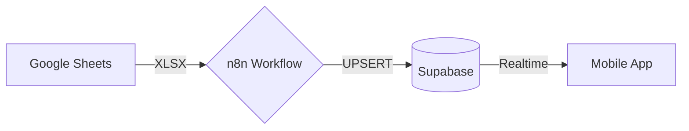

# 🗺� Estrutura e Mapas de Sincronização - v1.2

Este documento detalha como os dados saem da planilha e chegam ao aplicativo móvel.

## � Arquitetura do Fluxo

---

## 📋 Dicionário de Mapeamento (Planilha -> Banco)

O nó `Transformar_Dados` no n8n normaliza os campos para garantir que o Supabase receba sempre o formato correto.

| Campo na Planilha (Variantes) | Coluna no Supabase | Tipo de Dado | Destino no App (Card) |
| :--- | :--- | :--- | :--- |
| MAT, MATRICULA, CHAPA | `chapa` (PK) | Text | ID Único |
| NOME, NOME COMPLETO | `nome` | Text | Título do Card |
| FUNÇÃO RM ATUALIZADA | `funcao` | Text | Subtítulo |
| AREA DE NEGOCIO | `area` | Text | Card: �REA |
| CIP DE LIBERAÇÃO | `cid` | Text | - |
| RH | `rh` | Text | Card: RH |
| SAÚDE | `saude` | Text | Card: SAÚDE |
| SEGURANÇA | `seguranca` | Text | Card: SEGURANÇA |
| GRD, GERÊNCIA, GERENCIA | `grd` | Text | Card: GRD |
| OBSERVAÇÃO GRD, OBS | `obs_grd` | Text | Card: OBSERVAÇÕES |

---

## 🔒 Regras de Negócio e Filtros

1. **Filtro Temporal**: Registros com `DATA ADMISSÃO` fora do período de **01/01/2026 a Ontem** são descartados automaticamente para evitar poluição visual.
2. **Normalização de Chapa**: O sistema remove espaços em branco e garante que a Chapa seja tratada como string para comparação exata.
3. **Lógica de UPSERT**: 
    - Se a **Chapa** não existe no banco -> **INSERT**.
    - Se a **Chapa** existe e houve mudança em qualquer campo -> **UPDATE**.
    - Se os dados são idênticos -> **SKIP** (ignora para poupar recursos).

---

## � Localização dos Componentes
- **Workflow**: `Google Sheets → Supabase UPSERT Otimizado.json`
- **Tabela**: `public.liberation_data`
- **View UI**: `LiberationView` em `App.tsx`
