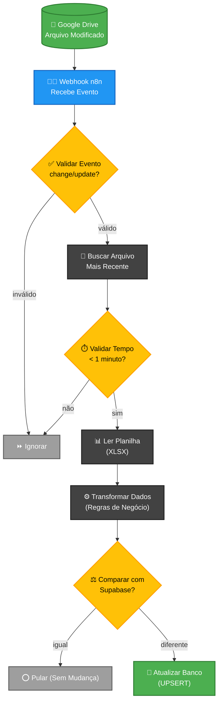

# Mapa Arquitetural v1.3 - Sincronização Instantânea

Este mapa descreve o fluxo lógico do sistema de sincronização, desde o evento no Google Drive até a atualização final no banco de dados.

### Explicação do Mapa:
1.  **Gatilho:** O Google Drive dispara um sinal assim que você salva ou sobe o arquivo.
2.  **Webhook:** O n8n "atende a chamada" e começa o processamento.
3.  **Validações:** O sistema verifica se o arquivo é o correto e se a mudança é recente o suficiente para evitar processamento duplicado.
4.  **Transformação:** As datas e nomes são normalizados para o formato do banco.
5.  **Comparação Inteligente:** O sistema só gasta recursos se houver uma diferença real entre o que está no Excel e o que está no Supabase.
