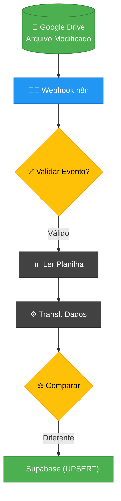

# Release Notes v1.3 - Sincronização Instantânea (Event-Based)

Esta versão marca a transição definitiva do sistema de sincronização de dados de um modelo de "Polling" (agendamento) para um modelo de "Push" (baseado em eventos), eliminando atrasos e corrigindo falhas históricas de integridade de dados.

## 🏗️ Arquitetura do Fluxo (Mapa Técnico)

Para uma visualização detalhada, consulte o documento completo: [MAPA_ARQUITETURAL_V1.3.md](file:///c:/Users/Adm/Downloads/eoorddinasmart/versao/v1.3-sincronizacao-event-based-final/MAPA_ARQUITETURAL_V1.3.md)

## 🚀 Principais Melhorias

### 1. Gatilho de Evento (Instantâneo)
*   **Antes:** O sistema rodava a cada 60 minutos. Se uma alteração fosse feita às 08:01, ela só refletia no app às 09:00.
*   **Agora:** O nó `Google Drive Trigger` monitora a pasta em tempo real. Assim que o Google Drive detecta a criação ou atualização do arquivo, o fluxo é disparado.

### 2. Sincronização de Status (Correção Zero-Error)
*   Corrigida a lógica de mapeamento que causava a inversão de status (ex: caso Zoe Angel). 
*   Removemos os nós obsoletos que utilizavam cache de dados antigos, garantindo que o processamento sempre utilize a versão mais recente da transformação de dados.

### 3. Integridade Total de Campos
*   Ajustada a captura dos campos de liberação: `RH`, `Saúde`, `Segurança` e `GRD`.
*   O sistema agora detecta preventivamente nomes de colunas variantes (ex: "GRD" ou "Gerência") para evitar campos vazios no banco.

## 🔧 Detalhes Técnicos
*   **Pasta Alvo:** `1Axzocv5JqWwo3_HYARQgL900mGfyyaOq`
*   **Protocolo:** OAuth2 via Google Drive API v3.
*   **Método de Gravação:** Upsert Dinâmico (INSERT/UPDATE apenas em caso de diferença real entre planilha e banco).

---
*Versão gerada em: 01 de Fevereiro de 2026*
