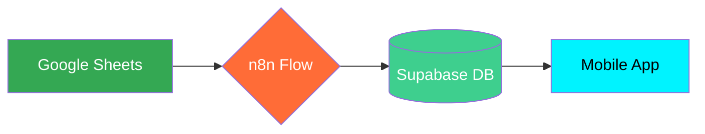

# Release Notes v1.4 - Identidade Cyber Teal & Fluxo Consolidado

Esta versão traz a nova identidade visual "Impactante" baseada em tons Cyber/Neon e consolida o fluxo de sincronização final para garantir estabilidade operacional.

## 🎨 Design System: Cyber Teal
Substituímos a paleta anterior por tons de **Teal Neon** e **Emerald Técnico**, aumentando o impacto visual e a modernidade da interface.

*   **Cor Primária:** `#00f3ff` (Teal Neon)
*   **Cor de Acento:** `#10b981` (Emerald)
*   **Sombras:** Atualizadas para refletir o brilho (glow) da nova marca.

## 🚀 Fluxo de Sincronização Consolidado
Oficializamos o uso do fluxo JSON: `Google Sheets → Supabase UPSERT Completo (FINAL CORRIGIDO).json`.

## 🔧 Melhorias Técnicas
*   **Correção de Sombras:** Ajuste dinâmico do `shadow-premium` para melhor legibilidade no `index.css`.
*   **Variáveis Globais:** Todas as cores agora são injetadas dinamicamente via `brand.config.ts`.

---
*Versão gerada em: 02 de Fevereiro de 2026*
