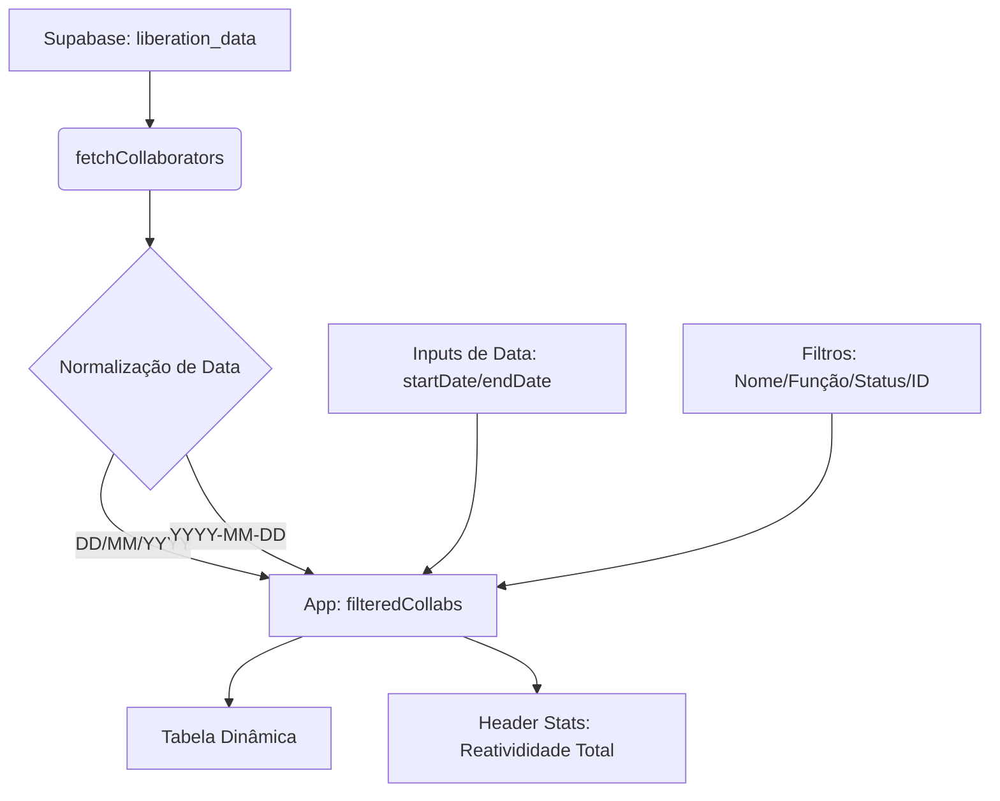

# RELEASE NOTES - v1.12 🚀
## Ecoordina Smart - Dashboard Intelligence

Esta versão foca na transformação do painel de **Liberação** em uma ferramenta de BI (Business Intelligence) totalmente reativa e precisa.

### 💎 O que há de novo?

1.  **Filtros de Período de Admissão**:
    *   Implementação de filtros de data ("Início Admissão" e "Fim Admissão") integrados ao grid principal.
    *   Suporte robusto a múltiplos formatos de data (**ISO 8601** e **BR - DD/MM/YYYY**), garantindo precisão cirúrgica na filtragem.
2.  **Dashboard 100% Reativo**:
    *   Os contadores superiores (**TOTAL**, **LIBERADOS** e **PENDENTES**) agora reagem instantaneamente a todos os filtros (Data, Nome, Função, Status e ID).
3.  **Refinamento de UX/UI**:
    *   Layout de filtros expandido para 6 colunas, otimizando o espaço e a visibilidade.
    *   Melhoria na ordenação da lista: os colaboradores mais recentes (dentro do período selecionado) aparecem sempre no topo.

### 🛠️ Correções Técnicas
*   **Parsing de Datas**: Adição do plugin `customParseFormat` do `dayjs` para interpretar corretamente as datas brasileiras provenientes do Supabase.
*   **Ordem de Hooks**: Reorganização dos `useMemo` para garantir a integridade dos dados e evitar referências circulares ou atrasadas.

### 📊 Fluxo de Dados Atualizado

---
**Equipe Antigravity** | *Construindo o futuro da gestão inteligente.*
