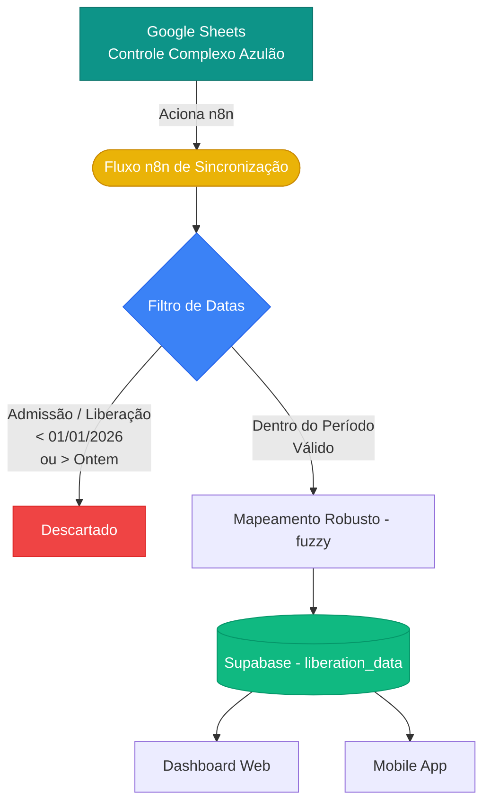

# Release Notes - v1.20 (Filtro de Datas n8n)

## 📅 Melhorias de Filtro Temporal (n8n)
- **Filtro Automático de Admissão e Liberação:** Todos os fluxos JSON do n8n que processam e sincronizam dados da planilha para o Supabase foram atualizados.
- **Período Focado:** Apenas colaboradores com *Data de Admissão* e *Data de Liberação E-COORDINA* situadas entre `01/01/2026` e `Ontem (today - 1)` são processados.
- **Otimização de Banco:** Isso evita a importação de dados antigos ou futuros indesejados, mantendo as tabelas do Supabase limpas e as querys mais rápidas para a tabela `liberation_data`.

## 🗺️ Mapa de Dados e Estrutura (Mermaid)

---
*Deploy e Tag da versão v1.20 criados com sucesso.*
