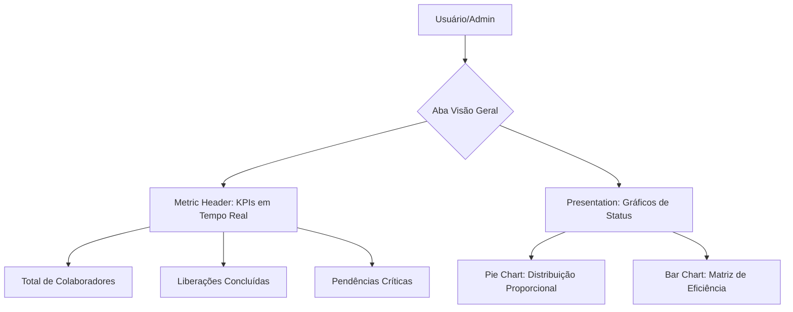

# Release Notes - v1.4 (Redesign Visão Geral)

## 📋 Resumo
Esta versão foca na transformação da tela de "Visão Geral" em uma apresentação executiva minimalista, de alto impacto e centrada em KPIs.

## 🚀 Novidades
- **Métricas no Topo:** KPIs (Total, Liberados, Pendentes, Eficiência) agora são exibidos imediatamente abaixo do cabeçalho.
- **Gráficos Minimalistas:** Gráficos de Pizza e Barras com rótulos de dados diretos (labels) para leitura sem necessidade de interação.
- **Cleanup da Interface:** Remoção do botão de exportação e de todas as listas/alertas inferiores para foco total no status global.

## 📊 Arquitetura de Fluxo

## 🛠️ Alterações Técnicas
- Modificação estrutural no componente `App.tsx`.
- Refinamento de cores e contraste nos cards `saas-card`.
- Adição de `LabelList` e `label` prop nos componentes Recharts.
- Limpeza de imports e código não utilizado (`Download`, `AlertCircle`).

---
Gerado automaticamente pelo CI/CD Google Antigravity.
