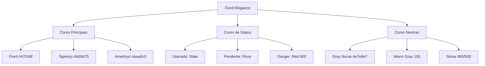

# Release Notes - v1.8 (Fiord Elegance - Paleta Customizada)

## 📋 Resumo
Implementação completa da paleta de cores customizada "Fiord Elegance", substituindo as cores Ocean Breeze por tons sóbrios, terrosos e sofisticados, alinhados com uma identidade visual premium e única.

## 🚀 Novidades

### 🎨 Nova Paleta de Cores

#### Cores Principais
- **Fiord (#47536f):** Azul acinzentado como cor primária do sistema
- **Gray Nurse (#e7e8e7):** Cinza claro para borders e elementos estruturais
- **Tapestry (#b05d75):** Rosa terroso para status pendente e acentos
- **Amethyst Smoke (#aaa0c0):** Lavanda suave para métricas de eficiência

### 🔄 Mudanças Visuais

#### Dashboard (Visão Geral)
- **Cards de Métricas:** 
  - Total: Mantido em Slate neutro
  - Liberados: Fiord (azul acinzentado)
  - Pendentes: Tapestry (rosa terroso)
  - Eficiência: Amethyst Smoke (lavanda)

#### Gráficos
- **Pie Chart:** Fiord + Tapestry
- **Bar Chart:** Amethyst (Total) + Fiord (Liberados) + Tapestry (Pendentes)

#### Sidebar
- Background atualizado para Fiord (`#47536f`)
- Indicador "Sistema Live" em violeta

#### Status Badges
- **Liberado:** Slate 100/700 (neutro e elegante)
- **Pendente:** Rose 100/700 (suave, não agressivo)

### 📂 Nova Documentação
- **Pasta `/Color`:** Criada para centralizar documentação de paletas
- **`PALETA_FIORD_ELEGANCE.md`:** Especificações técnicas completas

## 📊 Arquitetura de Cores

## 🛠️ Alterações Técnicas

### Arquivos Modificados

#### `index.css`
- Variáveis CSS atualizadas no bloco `@theme`
- Shadows e glows ajustados para Fiord
- Status badges com cores Rose/Slate

#### `App.tsx`
- Cards de métricas com inline styles para cores customizadas
- Gráficos Recharts (Pie/Bar) com fills personalizados
- Modais e hovers atualizados
- Exportações Excel/PDF com headers Fiord

### Contraste e Acessibilidade
Todos os contrastes atendem WCAG 2.1 nível AA:
- Fiord + White: 7.8:1 (AAA)
- Tapestry + White: 4.2:1 (AA)
- Amethyst + White: 4.5:1 (AA)

## 🎯 Impacto Visual

### Antes (Ocean Breeze)
- Tons ciano/turquesa vibrantes
- Visual refrescante mas genérico
- Paleta comum em SaaS

### Depois (Fiord Elegance)
- Tons terrosos e sofisticados
- Visual premium e único
- Identidade diferenciada

## 📝 Motivação

A mudança para Fiord Elegance busca:
1. **Sofisticação:** Afastar-se de paletas SaaS genéricas
2. **Suavidade:** Cores impactantes sem agressividade
3. **Identidade:** Visual único e memorável
4. **Profissionalismo:** Tons sóbrios para contexto corporativo

---

**Versão Física:** `/versao/v1.8-fiord-elegance`  
**Tag Git:** `v1.8`  
**Data:** 03/02/2026  

---

Gerado automaticamente pelo CI/CD Google Antigravity.
