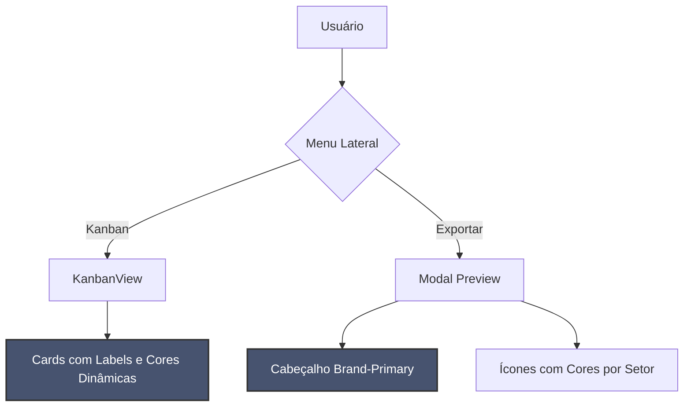

# Release Notes - v1.9-redesign-kanban-e-preview

## 🚀 O que há de novo?

Esta versão traz melhorias significativas na experiência do usuário (UX) e visual (UI), focando na clareza de informações e fluidez do sistema.

### 📋 Kanban Pro Max
- **Redesign dos Cards**: Novo fundo `slate-50` para destacar a informação sobre a superfície da aplicação.
- **Labels de Setores**: Inclusão de rótulos claros para cada setor (RH, Saúde, Segurança, GRD) dentro dos cards.
- **Ícones Expandidos**: Contêineres de ícones maiores e mais intuitivos.

### 📊 Pré-visualização do Relatório
- **Cabeçalho Premium**: Novo cabeçalho com a cor `brand-primary` (Fiord) e tipografia em branco.
- **Cores Dinâmicas nos Status**: Os ícones de check agora seguem o padrão de cores específico de cada setor, permitindo uma auditoria visual instantânea.

## 🛠️ Alterações Técnicas

## 📂 Arquivos Modificados
- `admin-dashboard/src/App.tsx`: Lógica de cores e novos componentes visuais.
- `admin-dashboard/src/index.css`: Ajustes de cores e variáveis de tema.
